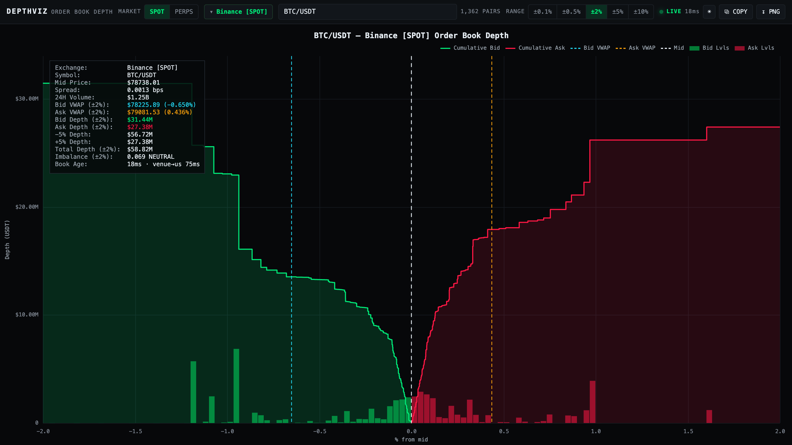
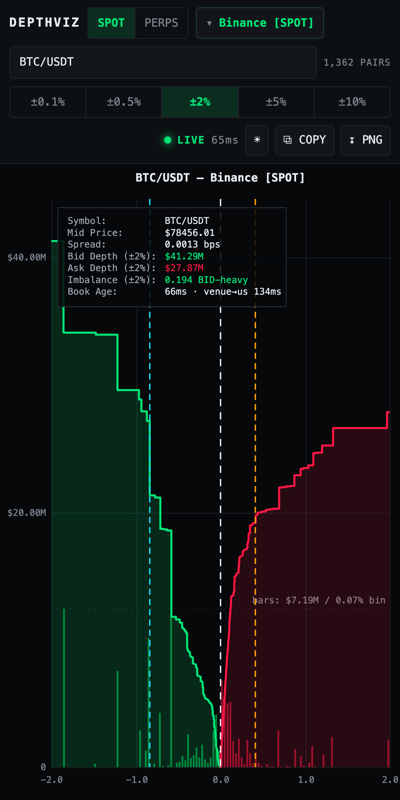

# depthviz

Live cumulative order-book depth visualizer across eight venues, spot and perp.
Pick a market type, an exchange and a symbol; get a cumulative depth curve with
the raw book levels underneath and a full metrics panel.



```bash
npm install
npm start          # http://127.0.0.1:8787
```

It binds loopback only. There is no authentication, and every viewer makes the
host open upstream connections to eight exchanges from *its* IP — on a box that
also runs trading bots, that is someone else's rate-limit budget. Exposing it is
therefore deliberate: `HOST=0.0.0.0 PORT=8888 npm start`.

## Exchange coverage (all verified live)

| Exchange | Spot | Perp | Transport | Levels / reach on BTC | Notes |
|---|---|---|---|---|---|
| OKX | 1 385 | 458 | **WS** `books` (incremental, seq-checked) + REST `books-full` tail @1s | 5 000 lv, ±1.3% | SWAP sizes are contracts; linear → `ctVal*ctMult`, inverse → `ctVal*ctMult/price` |
| Binance | 1 358 | 569 | **WS** diff depth @100ms + REST snapshot | 5 000 / 1 300 lv, **±10%** | canonical U/u (spot) and `pu` (futures) resync algorithm |
| MEXC | 1 982 | 1 129 | **WS** protobuf (spot) + **WS** JSON (perp), REST snapshot | 2 000 / 1 500 lv, ±5% / ±3% | contract sizes converted via `contractSize`; 8s poll watchdog behind both |
| Bitunix | 844 | 735 | REST poll 1s (spot) / **WS** `depth_books` (perp) | 50 lv ±0.05% / 16 000 lv **±12%** | spot book is capped by the exchange, see [tradeoffs](docs/architecture.md) |
| Hyperliquid | 326 | 177 | **WS** `l2Book` ×6 stitched | ~88 lv, **±11%** | six parallel `nSigFigs`/`mantissa` layers reconciled on cumulative quantity, see [tradeoffs](docs/architecture.md) |
| Coinbase | 521 | — | **WS** Advanced Trade `level2` (sequenced snapshot + updates) | ~22 000 lv, whole book | spot only; the PERP option greys it out |
| Aster | — | 553 | **WS** diff depth @100ms + REST snapshot | 1 000 lv snapshot ±2.7%, grows with uptime (±5.9% after 9 s) | perp DEX; Binance-futures API dialect, so it runs the shared `diff-book.js` engine |
| Lighter | — | 214 | **WS** whole-book snapshot + nonce-chained diffs | ~2 900 lv, past ±50% (clipped to ±12%) | perp DEX; markets addressed by numeric `market_id`, resolved from the symbol |

Aster and Lighter are perp DEXs and are exposed as perp only. Aster does list
spot pairs on a separate `sapi` host; that is a different, much thinner product
and is not wired up. Lighter publishes no active spot market at all.

Bitunix spot 24h volume is not a ticker read: the venue publishes no spot
ticker at all (every `/market/ticker*` path 404s), so it is summed from hourly
candles over a rolling 24h window, valuing each candle at its own close and
weighting the boundary candle by its overlap. That restored a real number
(~$125M on BTC/USDT) where the panel previously read `n/a`.

Pair counts are a **snapshot taken 2026-09-01** and drift daily as venues list
and delist — the app never uses them. Symbol lists are fetched from each venue's
own instruments endpoint at request time (5-minute cache), filtered to the
selected market type, and the live count is shown next to the search box.

Reach is what the chart can actually draw, not the snapshot size: Binance's and
MEXC's books grow past their capped snapshots by applying diffs
([tradeoff 4](docs/architecture.md)), so
they are quoted at the reach a settled feed holds, not at the REST limit.

## Metrics

Mid, spread in basis points, 24h volume, bid/ask VWAP with % distance from mid, bid/ask
cumulative depth inside the range, depth at ±2% and ±5%, total depth, and
depth imbalance = (bidDepth − askDepth) / (bidDepth + askDepth), labelled
BID-heavy / ASK-heavy outside ±0.15 with the raw number always shown.

The spread is quoted in **bps, not per cent**: one tick on BTC/USDT is
0.0000127%, which the panel used to render as `0.0000%` — the most important
number on screen displayed as zero. Basis points are the unit it is quoted in
and they are scale-free across a \$78 000 instrument and a \$0.0004 one.

Every band-scoped figure carries its band in its own label (`Bid Depth (±2%)`,
`Imbalance (±2%)`): a depth without the band it was measured over is not a
number anyone can act on. The imbalance is deliberately **not** called OFI —
order-flow imbalance is built from *changes* in the book between two instants,
and this is resting depth at one instant. Same arithmetic, different quantity,
and the name mattered to the people most likely to trade on it.

## Controls

Market toggle · exchange picker (Coinbase disabled under PERPS) · ranked symbol
search over the full live pair list · range ±0.1/0.5/2/5/10% · LIVE indicator
driven by real connection state (`connecting` / `live` / `reconnecting` /
`error` / `offline`) · theme toggle · COPY (panel text + JSON to clipboard) ·
PNG export.

The layout follows the viewport: below 760px the legend goes (its colours are
the panel's), the metrics panel keeps the rows a curve cannot tell you, and the
gutters shrink; below 480px the axis captions go too. The crosshair readout runs
on pointer events, so a finger drags it the way a mouse does — it was mouse-only,
which meant the chart carried no numbers at all on a phone.



Both images are live captures, regenerated by `node tools/shoot.mjs` against a
running server — not mockups.

## The JSON API

Every number on screen is also a `curl` away, computed by the same
`shared/metrics.js` the browser imports — so a script and the chart cannot
disagree.

```bash
curl 'http://127.0.0.1:8787/api/depth?exchange=okx&market=perp&symbol=BTC-USDT-SWAP&range=0.5'
```

```json
{
  "exchange": "okx", "market": "perp", "symbol": "BTC-USDT-SWAP", "range": 0.5,
  "transport": "ws", "metricsFrom": "shipped",
  "tsVenue": 1788428919609, "tsRecv": 1788428919707,
  "ageMs": 19, "venueLatencyMs": 98,
  "levels": [5003, 5009],
  "mid": 77651.55, "spreadPct": 0.000128,
  "bidDepth": 73619225.45, "askDepth": 102498614.87,
  "depthPlus2": 138519919.64, "depthMinus2": 96704574.43,
  "imbalance": -0.1639, "imbalanceLabel": "ASK-heavy",
  "reach": { "bid": 0.9105, "ask": 0.9548, "shortBid": false, "shortAsk": false }
}
```

**Two clocks, never conflated.** `tsVenue` is the exchange's own event time and
is `null` on the feeds that stamp nothing (a REST poll, Binance spot's
snapshot), so `venueLatencyMs` is a measurement or it is absent — never a zero
standing in for one. `tsRecv` is when the frame reached this process, so
`ageMs` is staleness. `reach` says how far the venue's book actually went, so a
caller can tell a thin book from a truncated one without reading the chart.

**The levels, when you need them.** `&levels=raw` returns the venue's own price
levels inside the range, in base units, and computes the figures from them;
`&levels=trimmed` returns the reduced `[vwapPrice, summedQty]` rows the browser
gets. The reduction is exact in cumulative notional, quantity and VWAP at ±2%,
±5% and ±10%, and interpolates between bucket edges — so *"what price does 40
BTC walk to"* is answerable only from the raw book. Which one the figures came
from is stated in `metricsFrom` rather than left to be worked out.

| route | |
|---|---|
| `GET /api/depth?exchange&market&symbol&range[&levels=raw\|trimmed]` | one depth reading as JSON (above) |
| `GET /api/symbols?exchange&market` | the venue's live instrument list |
| `GET /api/catalog` | venues, markets and transports |
| `GET /api/feeds[?history=1]` | per-feed health: book age, venue latency, reconnects, errors, dropped frames, and the last hour of samples behind them |
| `GET /metrics` | the same facts as a Prometheus exposition, for something that never sleeps |
| `WS /ws` | the streaming book the page itself uses |

On SIGTERM the process closes every upstream socket before exiting: systemd
restarts otherwise leave eight exchanges holding half-open connections from this
IP until they time out, and a restart loop stacks them.

`/api/depth` joins the same upstream feed a viewer would, and a feed with no
viewers is kept warm for 30 s — polling it does not reopen an exchange
connection every call. There is no authentication here and every distinct symbol
somebody opens spends this host's rate-limit budget at an exchange, so four
ceilings bound what one visitor can cost: 48 live feeds for the whole process
(`DEPTHVIZ_MAX_FEEDS`), **12 per client** (`DEPTHVIZ_MAX_FEEDS_PER_CLIENT`, so
one caller cannot take every slot and refuse everybody else), 24 websocket
connections per address (`DEPTHVIZ_MAX_SOCKETS_PER_IP`), and a token bucket on
the two routes that reach an exchange. A refusal is a `429` with a real
`Retry-After`, never a `504` — this server saying no is not the venue being
unwell. Behind a reverse proxy set `DEPTHVIZ_TRUST_PROXY=1`, or every caller
shares one budget.

## Layout

```
server/index.js     HTTP, websocket and the JSON API
server/hub.js       fan-out, payload reduction, feed lifecycle and health
server/util.js      reconnecting sockets, publish coalescing, the book side, the protobuf reader
server/quota.js     what one client may hold — kept out of the thing that opens sockets, so it is testable
server/health.js    the sample ring behind /api/feeds and the Prometheus exposition
server/adapters/    one file per venue + diff-book.js, the engine five feeds share
shared/metrics.js   every number on screen and in /api/depth — one implementation
public/             the page: ES modules and canvas, no build step
tools/              the proofs: unit tests, recorded venue fixtures, live verifiers, smoke tests
tools/record.mjs    the tape: raw books to JSONL, so a threshold can be re-derived rather than believed
docs/               the long-form documentation
deploy/             systemd units, the hourly check timer, the macOS launcher
```

## Proving it

A chart that renders beautifully with the wrong numbers is a worse bug than one
that crashes, because it does not announce itself — a missed contract multiplier
is a 100x error and the curve stays pretty. So the checks are the point:

```bash
npm test                # 400 assertions, no network: the pure cores, every venue's
                        # recorded frames, and one lifecycle contract applied to all 13 feeds
npm run crosscheck      # ccxt as an independent second opinion (server must be up)
npm run measure:drift   # re-derive the distributions the drift thresholds came from
npm run checks          # every proof in one run, for a timer; non-zero if any fails
```

A recording is how a measurement is made twice:

```bash
npm run record -- --exchange binance --market spot --symbol BTCUSDT --minutes 20 --gzip
npm run replay -- data/binance-spot-BTCUSDT-*.jsonl.gz          # distributions, gaps, coverage
npm run replay -- data/binance-spot-BTCUSDT-*.jsonl.gz --csv    # the series, for anything else
```

It records the **raw** book, not the reduced one, and writes `.part` until the
run finishes: a partial JSONL is byte-for-byte plausible, and a loop that
concluded from a file's size that a capture had succeeded has cost this repo
half an hour once already.

[**docs/verification.md**](docs/verification.md) is the long version: what each
suite pins, what CI deliberately refuses to run, how the Hyperliquid stitch was
caught eating 85% of the depth near mid, and what a check failing 5 runs in 26
taught about crying wolf.

## Documentation

| | |
|---|---|
| [Architecture and tradeoffs](docs/architecture.md) | why Node + canvas and no libraries, the eight tradeoffs each venue forced, the unit conversions and how they were verified, and when the note line appears |
| [Verification](docs/verification.md) | the test suites, the smoke tools, the hourly timer, and the two investigations that came out of it |
| [Deployment](docs/deployment.md) | systemd, deploying by patch, and a macOS launcher that keeps the SSH tunnel up |
| [Adding an exchange](docs/adding-an-exchange.md) | the adapter contract, and the shared snapshot+diff engine five feeds already run |

`CLAUDE.md` carries the working rules for this repo — every one of them written
after something here went wrong, with the measurement that caused it.

## Licence

MIT. See [LICENSE](LICENSE).
